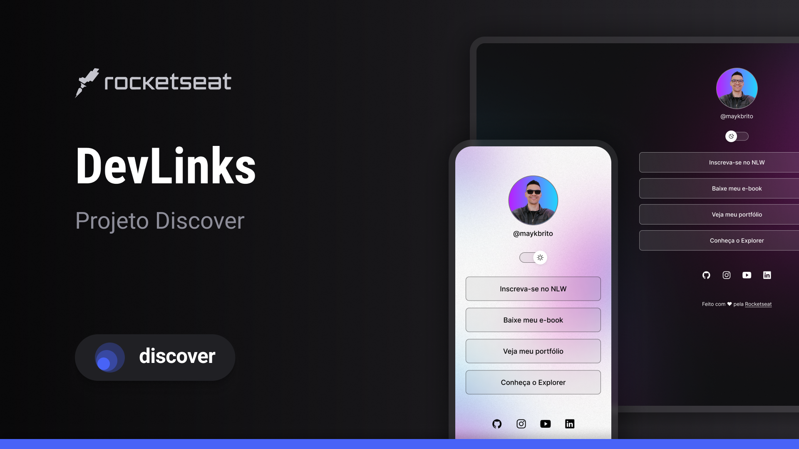

<h1 align="center"> Rockseat Discover </h1>

Projeto Devlinks disponibilizado através do curso Discover da Rockeatset.

  <a href="#-tecnologias">Tecnologias</a>&nbsp;&nbsp;&nbsp;|&nbsp;&nbsp;&nbsp;
  <a href="#-projeto">Projeto</a>&nbsp;&nbsp;&nbsp;|&nbsp;&nbsp;&nbsp;
  <a href="#-layout">Layout</a>&nbsp;&nbsp;&nbsp;|&nbsp;&nbsp;&nbsp;
  <a href="#memo-licença">Licença</a>

  

 

  

## 🚀 Tecnologias

Esse projeto foi desenvolvido com as seguintes tecnologias:

- HTML e CSS
- JavaScript
- Git e Github
- Figma

## 💻 Projeto

Agregador de links para cartão de visita online.

## 🔖 Layout

Você pode visualizar o layout do projeto através [DESSE LINK](https://www.figma.com/file/4Kot6g2eOIQDj6y00YDzE1/DevLinks-%E2%80%A2-Projeto-Discover-(Community)?type=design&node-id=1437-191&mode=design&t=5VxtFdhTaMeSpePL-0). É necessário ter conta no [Figma](https://figma.com) para acessá-lo.

## :memo: Licença

Esse projeto está sob a licença MIT.

---

Design feito com ♥ by Rocketseat
